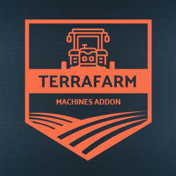

# TerraFarm - Machines Addon



This mod adds support for 3rd. party equipment.
TerraFarm now supports adding machine configurations inside mod archives (recommended), so this mod will eventually be discontinued once the community has made progress on creating cofigurations mods etc.

Integrated configurations will be prioritized, and will use these as fallback.

**Requires TerraFarm 0.9.5.0 or later installed**

Feel free to use this as base for your own configuration mod.

## How to download and install

Download the latest [```FS22_0_TerraFarmMachines.zip```](https://github.com/scfmod/FS22_TerraFarmMachines/releases/latest/download/FS22_0_TerraFarmMachines.zip) and copy/move it into you FS22 mods folder.

## List of supported equipment

### ModHub

- [Gjerstad Pack](https://www.farming-simulator.com/mod.php?lang=en&country=us&mod_id=242094&title=fs2022)
- [Lizard 320 Excavator - SD bucket](https://www.farming-simulator.com/mod.php?lang=en&country=us&mod_id=230612&title=fs2022)

### Kingmods.net
- [CAT D123 NG](https://www.kingmods.net/en/fs22/mods/34461/dozer-cat-d123) by AC

### ENGCON pack
```
- Cable bucket
- Deep digging bucket
- Broad deep digging bucket
- Grader bucket
- Water drainage bucket
```

### FSM
```
- Bomag BW120 roller
- Bomag roller
- CASE 1150M bulldozer
- CAT 980K shovel
- CAT 980K coal shovel
- CAT 980K mining shovel
- CAT D4NG bulldozer
- CAT D6 bulldozer blade
- CAT D6 ripper
- CAT D6R bulldozer
- CAT D6R ripper
- CAT D10T bulldozer
- CAT D10T ripper
- John Deere 700L bulldozer
- John Deere 700L ripper
- Komatsu 575D bulldozer
- Komatsu GD655 road leveler
- Komatsu WA1200C wheel loader
- Vermeer T75 trencher
- Volvo EC750EL excavator shovel
- Volvo EC750EL excavator mining shovel
- Volvo EC950E excavator
```