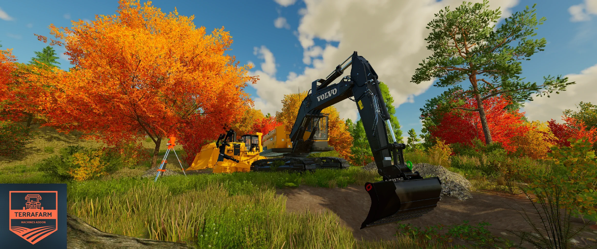

# TerraFarm - Machines Addon

This mod adds support for 3rd. party equipment.

Feel free to use this as base for your own configuration mod.

**Requires [TerraFarm](https://github.com/scfmod/FS22_TerraFarm) 0.9.5.0 or later installed**

## How to download and install

Download the latest [```FS22_0_TerraFarmMachines.zip```](https://github.com/scfmod/FS22_TerraFarmMachines/releases/latest/download/FS22_0_TerraFarmMachines.zip) and copy/move it into your FS22 mods folder.

## List of supported equipment

Thanks to contributions from Fallingblood there's now a lot more configurations!

Read the full mod list [here](./MODS.md).

**NOTE**: Not every single configuration has been tested.

**NOTE**: As there are endless number of mods versions and mods edits, it's pretty much impossible ensure configs works for all and everything.

### ModHub

- [BM Volvo Snow Gear](https://www.farming-simulator.com/mod.php?lang=en&country=jp&mod_id=279658)
- [Bobcat 863 Turbo With Bobcat Shovel](https://www.farming-simulator.com/mod.php?mod_id=240053)
- [Case 821G](https://www.farming-simulator.com/mod.php?lang=en&country=ar&mod_id=251323)
- [Gjerstad Pack](https://www.farming-simulator.com/mod.php?lang=en&country=us&mod_id=242094&title=fs2022)
- [John Deere 50G](https://www.farming-simulator.com/mod.php?lang=en&country=ie&mod_id=248023)
- [Large Universal Shovel](https://www.farming-simulator.com/mod.php?mod_id=244336)
- [Lizard 320 Excavator - SD bucket](https://www.farming-simulator.com/mod.php?lang=en&country=us&mod_id=230612&title=fs2022)
- [Lizard K9 Dozer Blade](https://www.farming-simulator.com/mod.php?lang=en&country=us&mod_id=282265&title=fs2022)
- [Wieska Package](https://www.farming-simulator.com/mod.php?lang=en&country=fi&mod_id=276667&title=fs2022)

### Kingmods.net
- [Bobcat MT100 CHS](https://www.kingmods.net/en/fs22/mods/30794/bobcat-mt100-chs)
- [BOMAG BT65](https://www.kingmods.net/en/fs22/mods/34254/bomag-bt65)
- [CAT D123 NG](https://www.kingmods.net/en/fs22/mods/34461/dozer-cat-d123)
- [Caterpillar 7495 HD](https://www.kingmods.net/en/fs22/mods/16905/caterpillar-7495-hd)
- [Caterpillar 836K](https://www.kingmods.net/en/fs22/mods/14852/caterpillar-836k)
- [International TD8E](https://www.kingmods.net/en/fs22/mods/30953/international-td8e)
- [John Deere 850](https://www.kingmods.net/en/fs22/mods/30956/john-deere-850)
- [Kubota U48](https://www.kingmods.net/en/fs22/mods/23269/kubota-u48)
- [NG CAT D5 LGP](https://www.kingmods.net/en/fs22/mods/31223/ng-cat-d5-lgp)
- [Sany 55C](https://www.kingmods.net/en/fs22/mods/35655/sany-55c)
- [Takeuchi Tl8R2](https://www.kingmods.net/en/fs22/mods/29555/takeuchi-tl8r2)
- [Volvo G740B, Volvo G740](https://www.kingmods.net/en/fs22/mods/23532/volvo-g740b-volvo-g740-champion-740a)
- [Wirgten W130_C](https://www.kingmods.net/en/fs22/mods/17639/wirgten-w130-c)

### JWeezy Construction
- [CAT 657G](https://jweezy-construction.itch.io/caterpillar-657g)

### MC Earthmoving
- [Cat 309CR](https://mc-earthmoving.itch.io/cat-309cr-no-thumb)

### ENGCON pack
```
- Cable bucket
- Deep digging bucket
- Broad deep digging bucket
- Grader bucket
- Water drainage bucket
```

## Misc.

```
- 4MR CAT 18M
- 4MR CAT 18M3
- 4MR CAT 150NG
- 4MR CAT 6015B
- 4MR CAT 6DT
- 4MR JD 544G
- 4MR John Deere 870G
- 4MR Hitachi EX8000
- 4MR Hitachi 2600EX
- 4MR Hitachi Zaxis 870LC
- AJsDeereLoader
- ARSweeperPack
- ARTANKPACK
- Ashland I200 TS4 scraper
- CASE DL550 shovel
- CASE DL550 ripper
- CAT 315 NGG
- CAT 988 shovel
- CAT D8T TriRipper
- Deere 764 Speed Dozer
- JCB Pack CX
- JD 4055 leveler
- John Deere 850 bulldozer blade
- John Deere CT332 high dump bucket
- Komatsu D355C blade
- Liebherr R9400
- PSI M413XT grader
- Takeuchi TB290 shovels
- Takeuchi TB290 blade
- Utility Tractor blade
- Utility Tractor shovel
- Volvo ECR145EL shovels
- Wheel Loader Road Pack
```

### FSM
```
- Bobcat T76
- Bomag BW120
- Bomag roller
- CASE 1150M
- CASE CX245
- CASE CX35B
- CASE 385C
- CASE 385C LR
- CASE 385C LR Amphibious
- CAT 349NG
- CAT 385C
- CAT 385C MH
- CAT 385C LR
- CAT 395NG
- CAT 430E
- CAT 527
- CAT 6015B
- CAT 908NG
- CAT 953D
- CAT 962NG
- CAT 963K
- CAT 963K ripper
- CAT 966E
- CAT 980K shovel
- CAT 980K coal shovel
- CAT 980K mining shovel
- CAT 982XE
- CAT 990H
- CAT 994K XL
- CAT D4N
- CAT D4NG
- CAT D5NG
- CAT D6
- CAT D6K2
- CAT D6N
- CAT D6R
- CAT D7NG
- CAT D8T TriRipper
- CAT D10T
- CAT CB 44NG
- CAT CP56
- CAT CW16
- CAT R3000H
- Dossan 80t
- John Deere 700L
- Komatsu 575D
- Komatsu GD655
- Komatsu WA1200C
- Vermeer T75
- Volvo EC750EL excavator shovel
- Volvo EC750EL excavator mining shovel
- Volvo EC950E
```